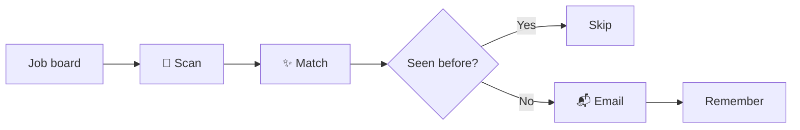

<p align="center">
  
</p>

<p align="center">
  <a href="https://github.com/christianwirick/RoleRadar/actions/workflows/ci.yml"></a>
  
  
  
</p>

RoleRadar watches a JavaScript-rendered job board, filters the noise, remembers what it already showed you, and emails the good stuff.

No tab hoarding. No manual refresh loop. Just a small CLI doing the lurking for you.

## Quick start

```bash
git clone https://github.com/christianwirick/RoleRadar.git
cd RoleRadar
make setup
source .venv/bin/activate
```

Create your private config outside the repo:

```bash
mkdir -p ~/.config/RoleRadar
cp .env.example ~/.config/RoleRadar/.env
chmod 600 ~/.config/RoleRadar/.env
```

Edit `~/.config/RoleRadar/.env`, then:

```bash
rr check
rr test
rr run
```

## Commands

| Command | What it does |
| --- | --- |
| `rr check` | Validate config and launch real headless Chrome/ChromeDriver |
| `rr test` | Scan the board without email or state changes |
| `rr run` | Email only matches RoleRadar has not seen before |
| `rr re` | Resend every current match without deleting saved state first |
| `rr jobs` | Show remembered jobs |
| `rr conf` | Show resolved config with the password hidden |
| `rr reset` | Forget remembered jobs |

## The loop



While it works, RoleRadar rotates through status lines such as:

```text
• Sweeping the radar...
• Filtering out the meh...
• Looking for the new-new...
• Preparing the reveal...
```

The fun stays in the progress messages. Counts, failures, and results stay explicit.

## Where your stuff lives

Runtime files never need to live in the Git checkout.

| File | Location |
| --- | --- |
| Config | `~/.config/RoleRadar/.env` |
| Remembered jobs | `~/.config/RoleRadar/seen_jobs.json` |
| Logs | `~/.config/RoleRadar/role_radar.log` |

The checked-in `.env.example` is only a template. `rr conf` never prints the email password.

## Chrome + ChromeDriver

`rr check` opens a real headless Chrome session. A successful check confirms that Selenium can launch Chrome with a working ChromeDriver.

If you pin a driver with `SE_CHROMEDRIVER`, RoleRadar also verifies that the path exists and is executable before launch.

## How scanning finishes

RoleRadar does not grab the page as soon as the first job appears. It waits for the rendered listing count to stop changing, then reads the final DOM. That matters on job boards that load hundreds of roles with JavaScript.

## Development

```bash
make check
```

CI runs linting, tests across supported Python versions, a Chrome/ChromeDriver smoke test, and a small secret-leak sanity check.

## License

BSD 3-Clause. See [LICENSE](LICENSE).
