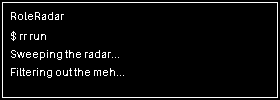

<p align="center">
  
</p>

# Stop refreshing job boards. Let the radar watch for you.

RoleRadar scans job boards, finds roles that match what you want, filters out jobs you've already seen, and alerts you when something new lands.

<p>
  <a href="https://github.com/christianwirick/RoleRadar/actions/workflows/ci.yml"></a>
  
  
  
</p>

<p align="center">
  
</p>

## What it does

```text
job board
   ↓
scan everything
   ↓
keep the titles you care about
   ↓
skip jobs already seen
   ↓
email the new ones
```

RoleRadar is intentionally small. One CLI, one config file, one state file.

## Quick start

```bash
git clone https://github.com/christianwirick/RoleRadar.git
cd RoleRadar
make setup
source .venv/bin/activate
```

Create your private config:

```bash
mkdir -p ~/.config/RoleRadar
cp .env.example ~/.config/RoleRadar/.env
chmod 600 ~/.config/RoleRadar/.env
```

Edit `~/.config/RoleRadar/.env`, then:

```bash
rr check
rr test
rr run
```

## Commands

| Command | What it does |
| --- | --- |
| `rr check` | Verify config and launch real headless Chrome/ChromeDriver |
| `rr test` | Scan without sending email or changing state |
| `rr run` | Email only matches RoleRadar has not seen before |
| `rr re` | Resend every current match without clearing saved state |
| `rr jobs` | Show remembered jobs |
| `rr conf` | Show resolved config with the password hidden |
| `rr reset` | Forget remembered jobs |

## A little personality while it works

RoleRadar rotates through status lines instead of repeating the same progress copy:

```text
• Sweeping the radar...
• Checking what the internet cooked up...
• Filtering out the meh...
• Looking for the new-new...
• Preparing the reveal...
```

Counts, failures, and final results stay explicit.

## Your files stay out of the repo

| File | Location |
| --- | --- |
| Config | `~/.config/RoleRadar/.env` |
| Remembered jobs | `~/.config/RoleRadar/seen_jobs.json` |
| Logs | `~/.config/RoleRadar/role_radar.log` |

The repository only carries `.env.example`. Your real credentials and runtime data stay under `~/.config/RoleRadar`.

## Smarter scraping

JavaScript job boards often render in waves. RoleRadar waits until the listing count stops changing before it reads the page, instead of grabbing the DOM as soon as the first role appears.

`rr check` also opens a real headless Chrome session, so a green check means Chrome + ChromeDriver can actually launch.

## Development

```bash
make check
```

CI covers:

- Python 3.10, 3.12, and 3.14
- Ruff
- pytest
- real Chrome/ChromeDriver smoke test
- tracked-secret and local-path sanity checks

## More

- [Roadmap](docs/TODO.md)
- [Changelog](docs/CHANGELOG.md)
- [Security policy](.github/SECURITY.md)
- [License](LICENSE)
